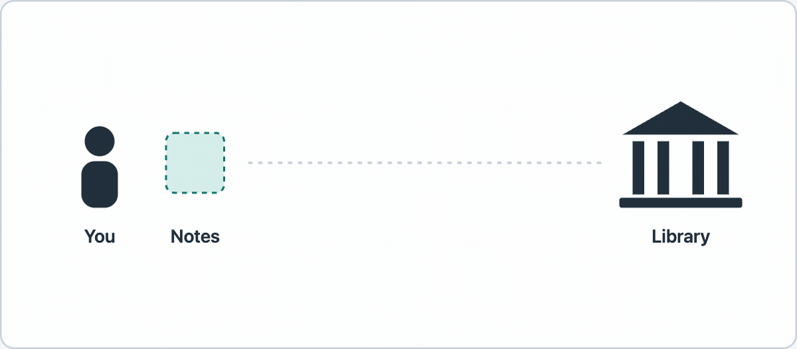

# marbaji-skills

Skills for [Claude Code](https://claude.com/claude-code) that work on anyone's machine. Each one is a self-contained folder with its instructions, its scripts and its tests, and each was tried by a fresh Claude session with nothing else installed before it was added.

## Install

```bash
claude plugin marketplace add marbaji/marbaji-skills
claude plugin install marbaji-skills@marbaji-skills
```

To take one skill without the rest, copy its folder from `skills/` into `~/.claude/skills/`.

## Skills

| Skill | What it does | Needs |
|---|---|---|
| [`animated-figure`](skills/animated-figure) | Makes a small animated explainer figure for one concept and exports it as a looping GIF, with the editable source. | Node 20 or newer, ffmpeg, Playwright |
| [`domain-check`](skills/domain-check) | Checks whether domain names are registered, from the terminal, with no account or API key. | bash, curl, whois |

Both are tested on macOS and Ubuntu Linux. Windows is untested.

### animated-figure

Ask for "an animated figure that explains how X works". Claude draws one diagram as an SVG animated with CSS, with one thing moving at a time, a handful of words, and a loop that ends on the point. The bundled exporter turns it into a GIF for a blog post, Medium, LinkedIn, X or a slide, and writes a sheet of six frames to review first.



`node skills/animated-figure/scripts/export.mjs --check` says which prerequisites are missing and how to install them.

### domain-check

Ask "is brightpath.com taken?" or hand over a list of candidate names. Each name comes back `AVAILABLE`, `TAKEN` or `UNCLEAR`, with the reason. It asks the registry where it can and falls back to `whois` where it cannot, and it says `UNCLEAR` instead of guessing.

```bash
bash skills/domain-check/scripts/check.sh --tlds "com io" brightpath
```

## What gets a skill in here

- It works with nothing of the author's installed: no private files, no paths into anyone's home folder.
- Its scripts have tests, and the tests run on every pull request.
- A fresh Claude session, given only the skill, has used it successfully.

## Contributing

Run the tests with `python3 -m pytest skills tests -q` (the `animated-figure` tests need its prerequisites; `npm install` in `skills/animated-figure/scripts` first).

Once per clone, turn on the pre-push check: `git config core.hooksPath .githooks`. From then on every `git push` first reads the commits you are about to push, including file names, commit messages and author details, for home-folder paths, personal email addresses and similar, and stops the push if it finds any. A pushed branch is public at once, so CI would be too late. To run it by hand: `python3 tests/personal_data_scan.py --commits origin/main..HEAD`. The scan finds known shapes of personal data, not all of it; read your diff as well.

## Licence

MIT. See [LICENSE](LICENSE).
